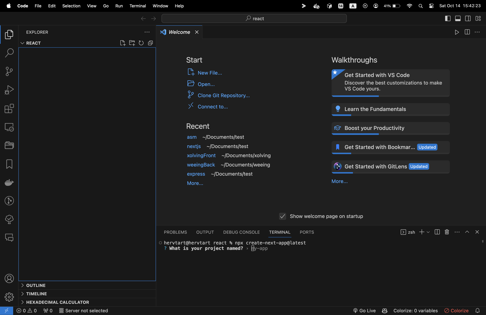
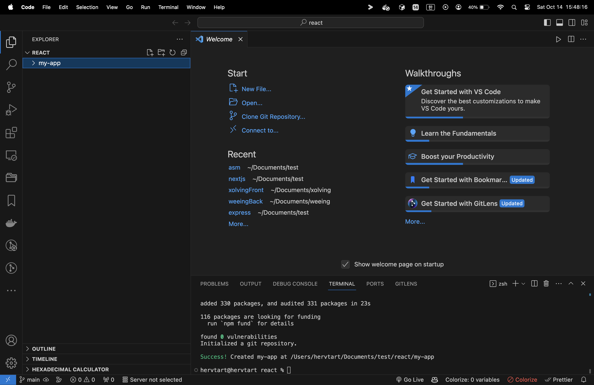
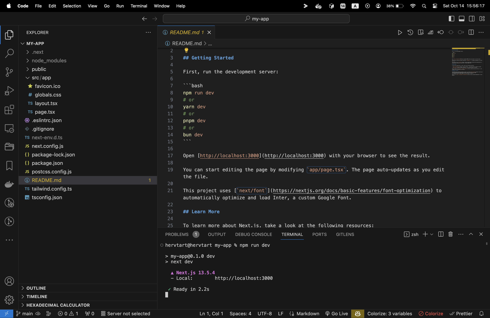
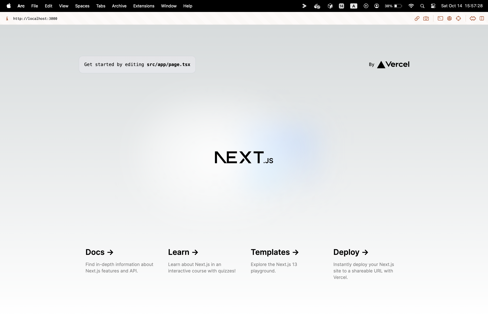

리액트를 사용하기 위해서는 Node.js가 필요합니다.
프로젝트를 구성하는 방법으로는 크게 4가지로 나뉩니다.
- Next.js: ```npx create-next-app@latest```
- Gatsby: ```npx create-gatsby```
- Remix: ```npx create-remix```
- Expo: ```npx create-expo-app```

우리는 프로젝트를 구성하기 위해서 Next.js를 사용해볼것입니다.
1. 프로젝트를 구성할 파일을 엽니다.
2. 터미널을 켜고 위의 명령어를 입력합니다.

> 프로젝트명 등을 정할 수 있습니다.

3. 아무것도 입력하지 않고 기본 값인 my-app을 그대로 써주세요
4. Typescript를 사용할 것인지
5. 물어보는데 yes를 눌러주세요.
6. ESlint를 사용할 것인지 물어보는데 yes를 눌러주세요.
7. Tailwind CSS를 사용할 것인지 물어보는데 yes를 눌러주세요.
8. src/ 디렉토리를 사용할 것인지 물어보는데 yes를 눌러주세요.
9. App Router을 사용할 것인지 물어보는데 yes를 눌러주세요.
10. import alias를 커스텀할 것인지 물어보는데 no를 눌러주세요.

> 디렉토리 안에 또 디렉토리가 생겨버렸습니다. 다음에는 터미널에서 프로젝트를 구성하고 열어야겠습니다.

일단 실행을 시켜보겠습니다. 생성된 README를 보면 ```npm run dev```이나 ```bun dev```으로 등으로 실행이 가능하다고 합니다.

> localhost:3000으로 실행된 것을 볼 수 있습니다.

크롬과 같은 브라우저에서 실행시켜보면 다음과 같은 예시 템플릿을 볼 수 있습니다.
