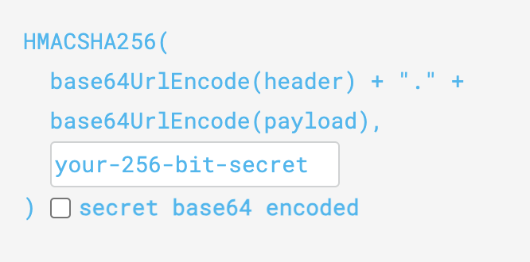
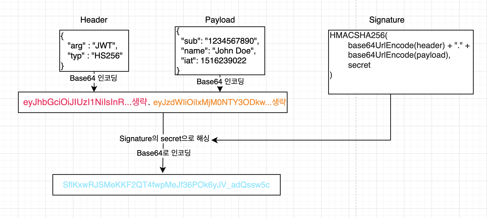

# 1. JWT의 구조
## 1.1 Header
헤더는 arg와 typ으로 이루어져있습니다.
- arg: 토큰의 타입을 나타냅니다. JWT
- typ: 해싱 알고리즘을 지정합니다. HMAC HS256 등

```json
{
	"arg" : "jwt",
	"typ" : "HS256"
}
```
## 1.2 Payload
페이로드는 토큰에 들어갈 정보를 지정합니다. 예시로 만들어보겠습니다.
```json
{
	"email" : "example@xolving.com",
	"exp" : "12345678"
}
```
## 1.3 Signature
서명은 Header의 인코딩된 값과 Payload의 인코딩된 값을 더한 후 정해진 secret으로 해싱됩니다.

# 2. 예시 과정
1. Header를 Base64로 인코딩합니다. -> Base64로 인코딩된 Header
2. Payload를 Base64로 인코딩합니다. -> Base64로 인코딩된 Payload
3. Base64로 인코딩된 Header와 Payload를 합칩니다.
4. Header와 Payload를 합친 문자열을 Signature에서 지정한 secret으로 해싱합니다. -> 해싱된 Signature
5. 해싱된 Signature를 Base64로 인코딩합니다. -> Base64로 인코딩된 Signature
Base64로 인코딩된 Header(빨간색) + Base64로 인코딩된 Payload(주황색) + Base64로 인코딩된 Signature(파란색)

